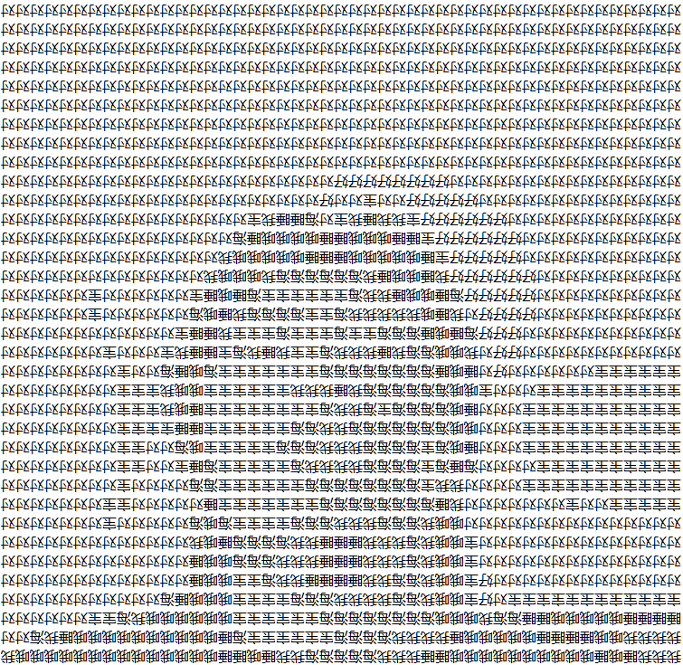

# Self as System / ASCII Art Webcam Thermal Printer

## Overview

#### Artwork info
*myReplica.txt*, 2024  
Mixed media  
5.9" x (7.7" or 55.5' variable dimensions) x 4.3"

#### Description
This project is an interactive wall art installation that captures webcam frames, converts them to ASCII art using Chinese characters, and prints the result on a thermal receipt printer.

## Features

- **Webcam Image Capture**: Automatically captures frames from the webcam every 10 seconds.
- **ASCII Art Conversion**: Converts the captured frames to ASCII art using a predefined set of Chinese characters to represent different levels of brightness. The set of characters represent a replica of me as data.
- **Optimized for Thermal Printer**: The ASCII art is resized and cropped to fit within the constraints of a 58mm thermal receipt printer, ensuring that the output looks correct without stretching.

#### Showcase

  
*Example of real-time ASCII art conversion from webcam feed*

#### Demo Images

*Example of printed ASCII art using the thermal receipt printer*

#### Install Shots

*FInal installation shot full view*

*FInal installation shot close up*

## Technology

- **Node.js**: Handles backend processing, including capturing webcam frames, converting them to ASCII art, and sending the output to the printer.
- **Jimp**: For image manipulation (cropping, resizing, and grayscale conversion).
- **Node-Webcam**: Captures real-time images from the webcam.
- **Notepad (Windows)**: Used to send the ASCII art to the thermal printer via the command line.
- **Thermal Receipt Printer**: Outputs the ASCII art (e.g., POS-58).
- **Physical Installation**: The installation is built using custom 3D-printed PLA parts and aluminum extrusion, housing the thermal printer, mini PC, and webcam that run the system in real-time.

## Credits

- **Jack Ji**: Project author and developer, responsible for the concept and implementation of the ASCII art conversion and printing system, as well as the creation of the physical installation.
- **Jimp (JavaScript Image Manipulation Program)**: Used for image processing, developed by various contributors in the open-source community.
- **Node-Webcam**: Webcam integration library used to capture real-time images, developed and maintained by the Node.js community.
